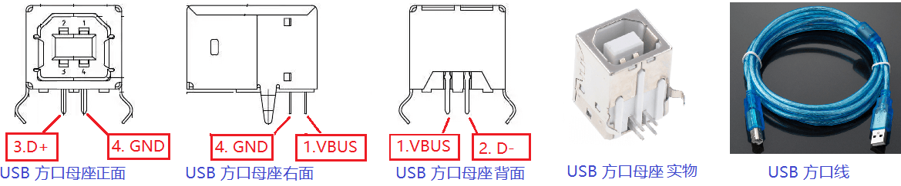

-CAD09D.svg)  

FPGA USB-device
===========================
FPGA USB-device 控制器。可实现 CDC (虚拟串口)，或 HID (键盘输入) 设备。已在 Windows 和 Linux 上成功识别和工作。

# 电路连接

    _________________
    |               |
    |   usb_dp_pull |-------|
    |               |       |
    |               |      |-| 
    |               |      | | 1.5k resistor is to pull-up or pull-down USB D+
    |               |      |_|            ____________              __________
    |               |       |             |          |              |
    |        usb_dp |-------^-------------| USB_D+   |              |
    |               |                     |          |  USB cable   |
    |        usb_dn |---------------------| USB_D-   |<------------>| Host PC
    |               |                     |          |              |
    |           GND |---------------------| GND      |              |
    |               |                     |          |              |
    -----------------                     ------------              ----------
          FPGA                           USB Connector                 电脑

上图左侧， `usb_dp_pull`, `usb_dp, usb_dn` 是 FPGA 的 3 个普通引脚（电平必须为 3.3V）。其中：

- `usb_dn` 接 `USB_D-`
- `usb_dp` 接 `USB_D+`
- `usb_dp_pull` 要通过 1.5kΩ 的电阻接  `USB_D+` 

为了进行如上连接，除了画 PCB 外，更快捷的方式是用 USB Connector （USB 母座）进行飞线连接，建议用 USB TypeB（俗称方口）母座，因为引脚间距大，便于焊接（如**图1**）。你需要把方口母座下方的针脚焊接到杜邦线上（别忘了焊接那个1.5kΩ 的电阻）；然后把杜邦线插在 FPGA 开发板上。

|  |
| :----------------------------------: |
|      **图1**：USB 方口母座与线       |

>  **注意**：USB中有一根线是 VBUS ，是 Host 提供给 Device 的 5V 电源，在这里不需要连接。

# 代码

| 文件名                          | 说明                                                         |
| ------------------------------- | ------------------------------------------------------------ |
| RTL/usbfs_core/*.sv             | 实现了一个 USB Device 控制器（Full Speed）                   |
| RTL/usb_cdc/usb_cdc_top.sv      | 调用 USB-device 控制器，实现 CDC 设备，用于虚拟串口通信      |
| RTL/usb_cdc/fpga_top_usb_cdc.sv | FPGA顶层。展示如何用 usb_cdc_top.sv 实现一个回环的虚拟串口（通过minicom/超级终端/串口助手发送的字符会回传）。已在 Windows 和 Linux 上成功识别和工作（操作系统自带驱动程序，无需额外安装） |
| RTL/usb_hid/usb_hid_top.sv      | 调用 USB-device 控制器，实现 HID 键盘，用于模拟键盘输入      |
| RTL/usb_hid/fpga_top_usb_hid.sv | FPGA顶层。展示如何用 usb_hid_top.sv 实现一个不断按下的键盘。已在 Windows 和 Linux 上成功识别和工作（操作系统自带驱动程序，无需额外安装） |

> **注意**：以上代码都是 SystemVerilog 行为级实现，支持任意 FPGA 平台。但除了 fpga_top_usb_cdc.sv 和 fpga_top_usb_hid.sv 里的 altpll 是仅限于 Altera Cyclone IV E 的原语，它用来生成 60MHz 时钟。如果你用的不是 Altera Cyclone IV E，请使用其它的 IP 核（例如 Xilinx 的 clock wizard）或原语来替换。

usb_cdc_top.sv 和 usb_hid_top.sv 中，我提供了简洁的调用接口，如下：

### module usb_hid_top

    input  wire        rstn,          // active-low reset, reset when rstn=0 (USB will unplug when reset), normally set to 1
    input  wire        clk,           // 60MHz is required
    // USB signals
    output wire        usb_dp_pull,   // connect to USB D+ by an 1.5k resistor
    inout              usb_dp,        // USB D+
    inout              usb_dn,        // USB D-
    // HID keyboard press signal
    input  wire [15:0] key_value,     // Indicates which key to press, NOT ASCII code! see https://www.usb.org/sites/default/files/hut1_21_0.pdf section 10.
    input  wire        key_request    // when key_request=1 pulses, a key is pressed.

### module usb_cdc_top

    input  wire        rstn,          // active-low reset, reset when rstn=0 (USB will unplug when reset), normally set to 1
    input  wire        clk,           // 60MHz is required
    // USB signals
    output wire        usb_dp_pull,   // connect to USB D+ by an 1.5k resistor
    inout              usb_dp,        // USB D+
    inout              usb_dn,        // USB D-
    // CDC receive data (host-to-device)
    output wire [ 7:0] recv_data,     // received data byte
    output wire        recv_valid,    // when recv_valid=1 pulses, a data byte is received on recv_data
    // CDC send data (device-to-host)
    input  wire [ 7:0] send_data,     // data byte to send
    input  wire        send_valid,    // when device want to send a data byte, set send_valid=1. the data byte will be sent successfully when (send_valid=1 && send_ready=1).
    output wire        send_ready     // send_ready handshakes with send_valid. send_ready=1 indicates send-buffer is not full and will accept the byte on send_data. send_ready=0 indicates send-buffer is full and cannot accept a new byte. 

# Break-Out

RTL/usbfs_core/usbfs_core_top.sv 实现了 USB-Transfer 层往下的完整协议。留出了 descriptor ROM 读接口、Endpoint 0x01 receive 接口和 Endpoint 0x81 send 接口，可以用来开发其它 USB-device。usb_cdc_top.sv 和 usb_hid_top.sv 皆是调用 usbfs_core_top.sv 来实现的。

例如，你可以仿照 usb_hid_top.sv ，修改 descriptor（描述符），并实现自定义的 send & receive 行为来实现其它 USB-device 。

我打算继续用它实现 USB Mass Storage Class (U盘)  和 USB Video Class (UVC 摄像头)。

# 参考资料

* https://www.usbmadesimple.co.uk/ : USB Made Simple
* https://github.com/FengJungle/USB_Protocol_CH : USB 中文协议手册
* 其它 FPGA 实现：
  * https://github.com/avakar/usbcorev : 一个 USB-device 控制器，仅支持到了 transaction 层。
  * http://jorisvr.nl/article/usb-serial : 一个 USB-CDC，VHDL实现，需要额外的 UTMI PHY。
  * https://github.com/pbing/USB : 一个 Low Speed 的 USB-HID 实现。
  * https://github.com/ultraembedded/cores : 包含一些 USB-host 和 USB-device 实现，需要 UTMI PHY 或 ULPI PHY。

