-9A90FD.svg)   

[English](#en) | [中文](#cn)

　


<span id="en">FPGA USB-device</span>
===========================

(Currently, English README is machine translated and has not been proofread. I will proofread it soon.)

USB 1.1 device controller. Realize various USB devices on FPGA. such as USB speaker and microphone, USB camera, USB disk, USB keyboard and USB serial port.

To realize USB devices on FPGA, the usual technical route is to use USB chips (such as Cypress CY7C68013), which leads to high development costs of circuits and software. This library uses FPGA to implement a universal USB 1.1 (Full Speed) device controller, which can use a very simple circuit to implement USB devices like STM32 microcontroller, without relying on additional USB chips. Based on this, I also implemented USB audio, USB camera, USB flash disk, USB keyboard and USB-Serial on the FPGA. They are the standard devices specified by USB, so they can plug and play without installing drivers.

Features of this library:

- Pure Verilog implementation for various FPGA models such as Xilinx, Altera, etc.
- The circuitry required is very simple, except for the FPGA, **Only three FPGA pins, one resistor and one USB interface socket are needed** (see [电路连接](#circuit)).

If you're not familiar with the USB stack, but want to quickly implement a USB device, you can use some of the USB features I've packaged:

- **USB audio**: is a composite device that includes a speaker and microphone (2-channel, 48ksps) and provides a streaming interface for receiving speaker audio data and sending microphone audio data.
- **USB camera**: Video can be transmitted to the computer (width and height can be customized), providing a streaming interface for sending video data.
- **USB flash drive**。
- **USB keyboard**: Provide the control interface of "key press".
- **USB-Serial** Realize serial port equipment, and use minicom, putty, HyperTerminal, serial port assistant and other software to transmit data with FPGA on the computer.
- **USB-Serial-2ch**: is a composite device that includes 2 independent USB-Serial.

If you are familiar with the USB stack, you can use this library to develop more USB devices (see [Secondary development of USB-device](#usbcore)). It provides:

- Customize 1 device descriptor, 1 configuration descriptor, and 6 string descriptors.
- 4 IN endpoints (0x81 \ ~ 0x84), 4 OUT endpoints (0x01 \ ~ 0x04).
- The optional debug output interface prints the debug information to the computer through an additional UART, and the communication process of the USB data packet can be seen.

 　

## Effect display

|                    | Windows 设备管理器中看到的设备 |Effect display|
| :----------------: | :----------------------------: | :----------------------------: |
|    **USB音频**     |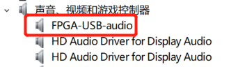| 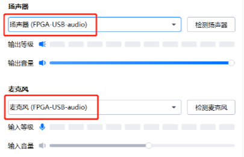  |
|   **USB摄像头**    |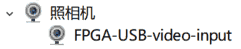| 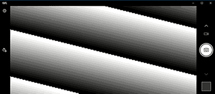 |
|      **U盘**       |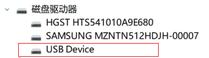|  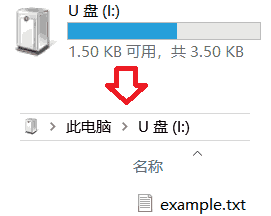  |
|    **USB键盘**     |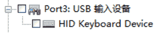|    每2秒按下一个英文字母键     |
|   **USB-Serial**   |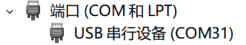| 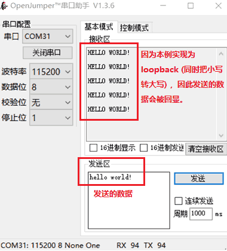 |
| **USB-Serial-2ch** |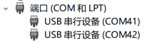|              同上              |

 　

## Compatibility

I tested the compatibility of these devices on different operating systems, as shown in the table below.

|     兼容性测试     |     Windows 10     |Linux Ubuntu 18.04|    macOS 10.15     |
| :----------------: | :----------------: | :----------------------------------: | :----------------: |
|    **USB音频**     | :heavy_check_mark: |:heavy_check_mark:  (no recognition bug solved)| :heavy_check_mark: |
|   **USB摄像头**    | :heavy_check_mark: |:heavy_check_mark:          |        :x:         |
|      **U盘**       | :heavy_check_mark: |:heavy_check_mark:          | :heavy_check_mark: |
|    **USB键盘**     | :heavy_check_mark: |:heavy_check_mark:          | :heavy_check_mark: |
|   **USB-Serial**   | :heavy_check_mark: |:heavy_check_mark:          | :heavy_check_mark: |
| **USB-Serial-2ch** | :heavy_check_mark: |:heavy_check_mark:  (Unrecognized bug resolved)| :heavy_check_mark: |

> :x:  macOS recognizes my USB camera device, but it can't read the video, for an unknown reason, to be resolved later.

 　

### Special thanks

- Thanks for [github.com/xiaowuzxc](https://github.com/xiaowuzxc) submitting the code for the USB speaker. I later expanded it to the current USB audio (speaker + microphone).
- Thanks to \ *\* \ *\* \ *8125@qq.com for solving the problem of one channel not being recognized in USB-Serial-2ch.

 　

# <span id="circuit"> I Circuit connection</span>

USB has `VBUS`, `GND`, `USB_D-`, `USB_D+` these 4 wires. Taking USB Type B connector (commonly known as USB square female connector) as an example, the four wires are defined as shown in the figure below.

||
| :-----------------------------------: |
|**Figure**: USB connector (square female) and cable.|

Please connect the circuit as shown in the figure below. Where `usb_dp_pull`, `usb_dp`, `usb_dn` are the three common IO pins of the FPGA (the level must be 3.3 V). Among

- Connection `USB_D-` of `usb_dn` FPGA. : warning: If it is a flying line connection, ensure that the length of the connecting line is within 10 cm. If it is a PCB connection, it should be connected to the `usb_dp` differential distribution line.
- Connection `USB_D+` of `usb_dp` FPGA. : warning: If it is a flying lead connection, make sure that the length of the connecting line is within 10 cm; if it is a PCB connection, make sure that it is connected to the `usb_dn` differential distribution line.
- The `usb_dp_pull` FPGA is connected through a 1.5kΩ resistor.
- The FPGA `GND` is connected to the USB connector.
- The USB connector `VBUS` is a 5V, 500ma power supply, which can be disconnected or supply power to the FPGA.


```
  _________________
  |               |
  |   usb_dp_pull |-------|
  |               |       |
  |               |      |-| 1.5k resistor
  |               |      | |
  |               |      |_|        ____________                  __________
  |               |       |         |          |                  |
  |        usb_dp |-------^---------| USB_D+   |                  |
  |               |                 |          |    USB cable     |
  |        usb_dn |-----------------| USB_D-   |<================>| Host PC
  |               |                 |          |                  |
  |           GND |-----------------| GND      |                  |
  |               |                 |          |                  |
  -----------------                 ------------                  ----------
        FPGA                          USB 连接座                      电脑
                       图 : FPGA 连接 USB 的方法
```

 　

# II List of Code Documents

[RTL](./RTL) The folder contains all the code, which is divided into three folders according to the level:

|                  文件夹                  |      层级       |Explain|
| :--------------------------------------: | :-------------: | :----------------------------------------------------------- |
| [RTL/fpga_examples](./RTL/fpga_examples) |     应用层      |Realize the specific application function on the basis of USB class. In order to facilitate testing, the application functions implemented here are very simple, such as loopback testing USB-Serial and generating black and white stripes to the USB camera. You can develop complex applications such as capturing data from a CMOS image sensor to a USB camera.|
|     [RTL/usb_class](./RTL/usb_class)     |    USB class    |Some USB classes are implemented on the basis of USB device core. For example, USB Communication Device Class (USB-CDC) is used to realize USB-Serial; USB Video Class (UVC) is used to realize camera.|
|    [RTL/usbfs_core](./RTL/usbfs_core)    | USB device core |A universal USB device core, which implements the processing of USB low-level signals, including from bit-level to transaction-level. Developers familiar with the USB stack can use it to develop more USB devices. See [Secondary development of USB device](#usbcore).|

 　

Specifically, each code file is described as follows:

|                  文件夹                  |          文件名          |Explain|
| :--------------------------------------: | :----------------------: | :----------------------------------------------------------- |
| [RTL/fpga_examples](./RTL/fpga_examples) |  fpga_top_usb_audio.v   |Connect the speaker of the USB _ audio _ top. V to the microphone in a loop, and the sound from the speaker will be recorded by the microphone.|
| [RTL/fpga_examples](./RTL/fpga_examples) |  fpga_top_usb_camera.v  |Generates a black and white stripe for the USB _ camera _ top. V, which can be seen with the camera software|
| [RTL/fpga_examples](./RTL/fpga_examples) |   fpga_top_usb_disk.v   |The USB flash disk of 24 KB FAT16 file system is implemented with USB _ disk _ top. V.|
| [RTL/fpga_examples](./RTL/fpga_examples) | fpga_top_usb_keyboard.v |Nerating a key signal to the USB _ keyboard _ top. V every 2 seconds;|
| [RTL/fpga_examples](./RTL/fpga_examples) |  fpga_top_usb_serial.v  |By looping back the sending and receiving of USB _ serial _ top. V, the transmitted characters are echoed back to the computer|
| [RTL/fpga_examples](./RTL/fpga_examples) | fpga_top_usb_serial2.v  |Connect the send and receive loops of the USB _ serial2 _ top. V, and the characters sent on the computer will be echoed|
|     [RTL/usb_class](./RTL/usb_class)     |     usb_audio_top.v     |Composite device, including 2 USB Audio Class (UAC), implementation|
|     [RTL/usb_class](./RTL/usb_class)     |    usb_camera_top.v     |USB Video Class (UVC) **USB camera**|
|     [RTL/usb_class](./RTL/usb_class)     |     usb_disk_top.v      |USB Mass Storage Class (USB-MSC) Implementation|
|     [RTL/usb_class](./RTL/usb_class)     |   usb_keyboard_top.v    |USB Human Interface Device Class (USB-HID) Implementation|
|     [RTL/usb_class](./RTL/usb_class)     |    usb_serial_top.v     |USB Communication Device Class (USB-CDC) Implementation|
|     [RTL/usb_class](./RTL/usb_class)     |    usb_serial2_top.v    |Composite device, containing 2 USB-CDCs, implementation of|
|    [RTL/usbfs_core](./RTL/usbfs_core)    |  **usbfs_core_top.v**   |Top module of USB device core|
|    [RTL/usbfs_core](./RTL/usbfs_core)    |   usbfs_transaction.v   |Implement USB transaction-level, which is called by usbfs _ core _ top. V.|
|    [RTL/usbfs_core](./RTL/usbfs_core)    |    usbfs_packet_rx.v    |Implement USB packet-level RX, which is called by the usbfs _ core _ top. V.|
|    [RTL/usbfs_core](./RTL/usbfs_core)    |    usbfs_packet_tx.v    |Realize USB packet-level TX, called by usbfs _ core _ top. V.|
|    [RTL/usbfs_core](./RTL/usbfs_core)    |    usbfs_bitlevel.v     |Realize USB bit-level and be called by usbfs _ core _ top. V.|
|    [RTL/usbfs_core](./RTL/usbfs_core)    |  usbfs_debug_monitor.v  |Collects debug information (does not interfere with USB functionality) and is called by the usbfs _ core _ top. V.|
|    [RTL/usbfs_core](./RTL/usbfs_core)    |        uart_tx.v        |Convert the debugging information to a UART signal, which is called by the usbfs _ core _ top. V.|

The following describes how to use each USB class provided by this library one by one. It will be introduced [Secondary development based on USB device core](#usbcore) at the end.

 　

# Ⅲ USB audio

The USB audio device in this library implements speaker + microphone. The code file calling relationship is as follows. Please add these files to the FPGA project, compile and burn them to the FPGA.

- RTL/fpga_examples/**fpga_top_usb_audio.v**
  - RTL/usb_class/**usb_audio_top.v**
    - RTL/usbfs_core/**usbfs_core_top.v**
      - Other.sv files in RTL/usbfs _ core/ (not listed individually)

> The USB core of this :warning:  library requires a 60 MHz drive clock. Altera's altpll primitive is **fpga_top_usb_audio.v** called to convert the crystal's 50MHz clock to a 60MHz clock. If your FPGA is not a Altera Cyclone IV, remove the altpll part of the code and use the corresponding primitive or IP core to generate the 60 MHz clock. For Xilinx FPGAs, for example, Clock Wizard IP can be used.

### Test

After the USB is plugged in, open Windows Device Manager and you should see the speaker and microphone devices:


Because **fpga_top_usb_audio.v** the speaker and the microphone are connected in a loop, the playback of the speaker is recorded by the microphone. To test, first select the device as the audio output device:

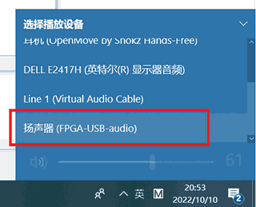

Then play a random music. Then use any recording software or video recording software (such as obstudio), select FPGA-USB-Audio as the input microphone, and record an audio or video. In the end you will find that the recorded audio is the same as the music you play.

### Application development

You can develop more complex audio applications based on this simple example, for which you need to pay attention to **usb_audio_top.v** the module interface. See the code comments for details, so I won't repeat them here.

 　

# IV USB camera

The calling relationship of the code file of the USB camera device in this library is as follows. Please add these files to the FPGA project, compile and burn them to the FPGA.

- RTL/fpga_examples/**fpga_top_usb_camera.v**
  - RTL/usb_class/**usb_camera_top.v**
    - RTL/usbfs_core/**usbfs_core_top.v**
      - Other.sv files in RTL/usbfs _ core/ (not listed individually)

> The USB core of this :warning:  library requires a 60 MHz drive clock. Altera's altpll primitive is **fpga_top_usb_camera.v** called to convert the crystal's 50MHz clock to a 60MHz clock. If your FPGA is not a Altera Cyclone IV, remove the altpll part of the code and use the corresponding primitive or IP core to generate the 60 MHz clock. For Xilinx FPGAs, for example, Clock Wizard IP can be used.

### Test

After the USB is plugged in, open the Windows Device Manager and you should see the camera device:


Open the camera software that comes with Windows 10, and you should see a scrolling black and white stripe:


### Application development

You can develop more complex camera applications based on this simple example, for which you need to pay attention to **usb_camera_top.v** the module interface (see code comments for details).

#### Parameters of USB _ camera _ top. V.

The key parameters are described here:


```verilog
// parameters of usb_camera_top.v
parameter        FRAME_TYPE = "YUY2",    // "MONO" or "YUY2"
parameter [13:0] FRAME_W    = 14'd320,   // video-frame width  in pixels, must be a even number
parameter [13:0] FRAME_H    = 14'd240,   // video-frame height in pixels, must be a even number
```

You can set the width and height of the video frame with `FRAME_W` and `FRAME_H`. `FRAME_TYPE` Desirable `"MONO"` or `"YUY2"`.

##### FRAME_TYPE="MONO"

 `FRAME_TYPE="MONO"` Is a grayscale mode, and each pixel corresponds to a lightness value of 1 byte. For example, for a 4x3 video frame, the module reads the following 12 bytes successively from the outside world:


```
Y00  Y01  Y02  Y03  Y10  Y11  Y12  Y13  Y20  Y21  Y22  Y23
```

Where Y00 is the lightness value of row 0, column 0; Y01 is the lightness value of row 0, column 1;..

##### FRAME_TYPE="YUY2"

 `FRAME_TYPE="YUY2"` A color mode, also known as YUYV, in which each pixel has an independent 1-byte lightness value (Y), while two adjacent pixels share a 1-byte blue chrominance (U) and a 1-byte red chrominance (Y). For example, for a 4x2 video frame, the module reads the following 16 bytes successively from the outside world:


```
Y00  U00  Y01  V00  Y02  U02  Y03  V02  Y10  U10  Y11  V10  Y12  U12  Y13  V12
```

Where (y00, u00, v00) is the pixel at the 0th row and the 0th column; (y01, u00, v00) is the pixel at the 0th row and the 1st column; (y02, u02, v02) are the pixels at the 2nd row and the 2nd column; and (y03, u02, v02) are the pixels at the 3rd row and 3rd column.

#### USB _ camera _ top. V signal

The signal **usb_camera_top.v** used to read the pixel from the outside is:


```verilog
// pixel fetch signals of usb_camera_top.v    start-of-frame |  frame data transmitting   | end-of-frame
output reg         vf_sof,                // 0000000001000000000000000000000000000000000000000000000000000    // vf_sof=1 indicate a start of video-frame
output reg         vf_req,                // 0000000000000000010001000100010001000100010001000000000000000    // when vf_req=1, a byte of pixel data on vf_byte need to be valid
input  wire [ 7:0] vf_byte,               //                                                                  // a byte of pixel data
```

Video frames **usb_camera_top.v** are continuously read and sent to the Host-PC via the above signals. At the beginning of each video frame, `vf_sof` a cycle of high levels occurs. The next highest level will then `vf_req` occur **N** intermittently, where **N** is the number of bytes of the video frame, for `FRAME_TYPE="MONO"`, **N** = frame width X frame height; For `FRAME_TYPE="YUY2"`, **N** = 2 × frame width × frame height. Each time `vf_req=1`, the outside world should provide a byte (pixel data) onto the `vf_byte` signal, which should be asserted on `vf_req=1` the fourth clock cycle `vf_byte` at the latest and remain asserted until the next time `vf_req=1`.

### Frame rate and performance

This module sends the video to the Host-PC with a fixed bandwidth. The larger the video frame size, the smaller the frame rate. The theoretical bandwidth of USB Full Speed is 12Mbps. In fact, the module sends 800 bytes of pixel data (400 pixels) every 1ms. Therefore, the approximate calculation formula of the frame rate is:

Frame Rate = 400000/ (Frame Width * Frame Height)

 　

# Ⅴ U disk

The calling relationship of the code file of the U disk device in this library is as follows. Please add these files to the FPGA project, compile and burn them to the FPGA.

- RTL/fpga_examples/**fpga_top_usb_disk.v**
  - RTL/usb_class/**usb_disk_top.v**
    - RTL/usbfs_core/**usbfs_core_top.v**
      - Other.sv files in RTL/usbfs _ core/ (not listed individually)

> The USB core of this :warning:  library requires a 60 MHz drive clock. Altera's altpll primitive is **fpga_top_usb_disk.v** called to convert the crystal's 50MHz clock to a 60MHz clock. If your FPGA is not a Altera Cyclone IV, remove the altpll part of the code and use the corresponding primitive or IP core to generate the 60 MHz clock. For Xilinx FPGAs, for example, Clock Wizard IP can be used.

### Test

After the USB is plugged in, open Windows Device Manager and you should see a hard drive:


Windows File Explorer should see the hard drive with a "file" example. Txt ". You can add, modify and delete files in this hard disk. Since it is implemented with the FPGA's on-chip memory (BRAM), all your modifications will disappear when the FPGA is powered off or reburned. The free space of this hard disk is only 3.5 KB, which is basically useless and only for testing.


### Application development

You can develop larger or more complex USB-disks based on this simple example, for which you need to pay attention to **usb_disk_top.v** the module interface (see code comments for details).

The key signals are described here, including:


```verilog
// signals of usb_disk_top.v
output reg  [40:0] mem_addr,      // byte address
output reg         mem_wen,       // 1:write   0:read
output reg  [ 7:0] mem_wdata,     // byte to write
input  wire [ 7:0] mem_rdata,     // byte to read
```

These signals are used for reading and writing **Storage space of hard disk**. `mem_addr` Is a 41-bit byte address, so the addressing space is 2 ^ 41 = 2 TB. However, the actual hard disk storage space must be less than 2 TB, so only the addresses from `mem_addr=0` to `mem_addr=硬盘容量` are valid. At each clock cycle:

- If `mem_wen=1`, the Host wants to write one byte of data to the device, the write address is `mem_addr`, and the write data is `mem_wdata`;
- If `mem_wen=0` the device needs to read a byte of data, the read address is `mem_addr`, and the read data should be sent to the `mem_rdata` next cycle.

This interface is very easy to connect to the BRAM of FPGA, so we use BRAM to realize the storage space of hard disk.

In order for disk to be recognized as a formatted hard disk, you can provide an initial data to the BRAM, which contains a file system. The BRAM **fpga_top_usb_disk.v** in implements a FAT16 file system with a total size of 24KB.

> :warning:  A file system is a data structure used to organize files and is stored on the hard disk as the files themselves. The production method is more complicated and will not be repeated here. If you need to make a customized U disk device, you can contact me through issue.

 　

# VI USB keyboard

The calling relationship of the code file of the USB keyboard device in this library is as follows. Please add these files to the FPGA project, compile and burn them to the FPGA.

- RTL/fpga_examples/**fpga_top_usb_keyboard.v**
  - RTL/usb_class/**usb_keyboard_top.v**
    - RTL/usbfs_core/**usbfs_core_top.v**
      - Other.sv files in RTL/usbfs _ core/ (not listed individually)

> The USB core of this :warning:  library requires a 60 MHz drive clock. Altera's altpll primitive is **fpga_top_usb_keyboard.v** called to convert the crystal's 50MHz clock to a 60MHz clock. If your FPGA is not a Altera Cyclone IV, remove the altpll part of the code and use the corresponding primitive or IP core to generate the 60 MHz clock. For Xilinx FPGAs, for example, Clock Wizard IP can be used.

### Test

After the USB is plugged in, open Windows Device Manager and you should see a keyboard device:


The keyboard presses the English letter keys every 2 seconds. Open a notepad to see the effect.

### Application development

You can develop more complex keyboard applications based on this simple example, for which you need to pay attention to **usb_keyboard_top.v** the module interface (see code comments for details).

Here, the signal used to transmit the key signal is described:


```verilog
// signals of usb_keyboard_top.v:
input  wire [15:0] key_value,     // Indicates which key to press, NOT ASCII code! see https://www.usb.org/sites/default/files/hut1_21_0.pdf section 10.
input  wire        key_request,   // when key_request=1 pulses, a key is pressed.
```

 `key_request` Usually needs to maintain 0, when you need to press a key, need to let `key_request=1` a cycle, at the same time on `key_value` the input code corresponding to the key. Refer to https://www.usb.org/sites/default/files/hut1_21_0.pdf  Section 10 for the definition of key code. For example, keys' a '- `key_value=16'h0004~16'h001D` ' Z 'correspond, and keys' 1'- `key_value=16'h001E~16'h0027` '0' correspond.

 　

# Ⅶ USB-Serial

The calling relationship of the code file of the USB-Serial device in this library is as follows. Please add these files to the FPGA project, compile and burn them to the FPGA.

- RTL/fpga_examples/**fpga_top_usb_serial.v**
  - RTL/usb_class/**usb_serial_top.v**
    - RTL/usbfs_core/**usbfs_core_top.v**
      - Other.sv files in RTL/usbfs _ core/ (not listed individually)

> The USB core of this :warning:  library requires a 60 MHz drive clock. Altera's altpll primitive is **fpga_top_usb_serial.v** called to convert the crystal's 50MHz clock to a 60MHz clock. If your FPGA is not a Altera Cyclone IV, remove the altpll part of the code and use the corresponding primitive or IP core to generate the 60 MHz clock. For Xilinx FPGAs, for example, Clock Wizard IP can be used.

### Test

After the USB is plugged in, open the Windows Device Manager and you should see a USB-serial device:


In this example, the **usb_serial_top.v** received data is converted from lowercase letters to uppercase letters according to ASCII code, and then looped back to the sending interface. You can send data to Serial Port with minicom, putty, HyperTerminal, and Serial Assistant software on Host-PC, and the sent data will be echoed (with lowercase letters converted to uppercase letters). Take the serial port assistant as an example, as shown in the figure below.


> :warning:  Because the Serial-Port is not a true UART, it is also called **Virtual serial port**. Setting the baud rate, data bit, check bit, and stop bit of the virtual serial port will not have any effect.

### Application development

You can develop more complex Serial-Port communication applications based on this simple example, for which you need to pay attention to **usb_serial_top.v** the module interface (see the code comments for details).

The key signals are described here, including:


```verilog
// signals of usb_serial_top.v
// receive data (host-to-device)
output wire [ 7:0] recv_data,     // received data byte
output wire        recv_valid,    // when recv_valid=1 pulses, a data byte is received on recv_data
// send data (device-to-host)
input  wire [ 7:0] send_data,     // data byte to send
input  wire        send_valid,    // when device want to send a data byte, set send_valid=1. the data byte will be sent successfully when (send_valid=1 && send_ready=1).
output wire        send_ready,    // send_ready handshakes with send_valid. send_ready=1 indicates send-buffer is not full and will accept the byte on send_data. send_ready=0 indicates send-buffer is full and cannot accept a new byte. 
```

The signal of host-to-device is relatively simple. Every time a data byte is received, `recv_valid` the high level of a cycle appears, and the byte appears at the same time `recv_data`.

The device-to-host signal is in the opposite direction, and there is an `send_ready` extra signal, `send_ready=0` indicating that the send buffer inside the module is full and cannot send new data for the time being. `send_ready` And `send_valid` form a handshake signal, when the user needs to send a byte, should let `send_valid=1`, at the same time let the byte appear again `send_data`. At `send_valid=1 && send_ready=1` that point, the byte is successfully sent to the send buffer, and the user can proceed to send the next byte. The handshake mechanism is similar to AXI-stream.

There is a send buffer of 1024 bytes **usb_serial_top.v** in. If the throughput rate of the data to be sent is not large, the send buffer will never be full, and the signal can also be ignored `send_ready`. However, when the data throughput rate is large, which may cause the sending buffer to be full, some data may be lost if the situation is ignored `send_ready=0`.

 　

# Ⅷ Dual-channel USB-Serial

The calling relationship of the code file of the dual-channel USB-Serial device in this library is as follows. Please add these files to the FPGA project, compile and burn them to the FPGA.

- RTL/fpga_examples/**fpga_top_usb_serial2.v**
  - RTL/usb_class/**usb_serial2_top.v**
    - RTL/usbfs_core/**usbfs_core_top.v**
      - Other.sv files in RTL/usbfs _ core/ (not listed individually)

> The USB core of this :warning:  library requires a 60 MHz drive clock. Altera's altpll primitive is **fpga_top_usb_serial2.v** called to convert the crystal's 50MHz clock to a 60MHz clock. If your FPGA is not a Altera Cyclone IV, remove the altpll part of the code and use the corresponding primitive or IP core to generate the 60 MHz clock. For Xilinx FPGAs, for example, Clock Wizard IP can be used.

### Test

After the USB is plugged in, open the Windows Device Manager and you should see 2 USB-serial devices:


The test method is the same as that of the single-channel USB-Serial, which will not be described here.

### Application development

You can develop a more complex Serial-Port communication application based on this simple example. For this, you need to pay attention to **usb_serial2_top.v** the module interface (see the code comment for details). Its usage is the same as that of the single-channel USB-Serial, except that the sending and receiving interfaces have become dual-channel, which will not be repeated here.

 　

# <span id="usbcore"> Ⅸ Secondary development based on USB device core</span>

You can use to **usbfs_core_top.v** develop other USB devices, which provide:

- Customize 1 device descriptor, 1 configuration descriptor, and 6 string descriptors.
- In addition to the control endpoint (0 x00), four IN endpoints (0x81 \ ~ 0x84) and four OUT endpoints (0x01 \ ~ 0x04) are provided.
- The optional debug output interface prints the debug information to the computer through an additional UART, and the communication process of the USB data packet can be seen.

The parameters and input and output signals of the are described below **usbfs_core_top.v**.

### Parameters of usbfs _ core _ top. V.

**usbfs_core_top.v** The parameters are shown in the following table.

| usbfs_core_top 的参数 | 类型                                    |Explain|
| --------------------- | --------------------------------------- | -------------------------------------------- |
| `DESCRIPTOR_DEVICE`   | `logic[7:0][18]` (字节数组，长度为18)   |Device descriptor|
| `DESCRIPTOR_STR1`     | `logic[7:0][64]` (字节数组，长度为64)   |String descriptor 1|
| `DESCRIPTOR_STR2`     | `logic[7:0][64]` (字节数组，长度为64)   |String Descriptor 2|
| `DESCRIPTOR_STR3`     | `logic[7:0][64]` (字节数组，长度为64)   |String Descriptor 3|
| `DESCRIPTOR_STR4`     | `logic[7:0][64]` (字节数组，长度为64)   |String Descriptor 4|
| `DESCRIPTOR_STR5`     | `logic[7:0][64]` (字节数组，长度为64)   |String Descriptor 5|
| `DESCRIPTOR_STR6`     | `logic[7:0][64]` (字节数组，长度为64)   |String Descriptor 6|
| `DESCRIPTOR_CONFIG`   | `logic[7:0][512]` (字节数组，长度为512) |Configuration descriptor|
| `EP00_MAXPKTSIZE`     | `logic[7:0]`| control endpoint 最大包大小                  |
| `EP81_MAXPKTSIZE`     | `logic[9:0]`| IN endpoint 0x81 最大包大小                  |
| `EP82_MAXPKTSIZE`     | `logic[9:0]`| IN endpoint 0x82 最大包大小                  |
| `EP83_MAXPKTSIZE`     | `logic[9:0]`| IN endpoint 0x83 最大包大小                  |
| `EP84_MAXPKTSIZE`     | `logic[9:0]`| IN endpoint 0x84 最大包大小                  |
| `EP81_ISOCHRONOUS`    |0 or 1| IN endpoint 0x81 是否是 isochronous 传输模式 |
| `EP82_ISOCHRONOUS`    |0 or 1| IN endpoint 0x82 是否是 isochronous 传输模式 |
| `EP83_ISOCHRONOUS`    |0 or 1| IN endpoint 0x83 是否是 isochronous 传输模式 |
| `EP84_ISOCHRONOUS`    |0 or 1| IN endpoint 0x84 是否是 isochronous 传输模式 |
| `EP01_ISOCHRONOUS`    |0 or 1| IN endpoint 0x01 是否是 isochronous 传输模式 |
| `EP02_ISOCHRONOUS`    |0 or 1| IN endpoint 0x02 是否是 isochronous 传输模式 |
| `EP03_ISOCHRONOUS`    |0 or 1| IN endpoint 0x03 是否是 isochronous 传输模式 |
| `EP04_ISOCHRONOUS`    |0 or 1| IN endpoint 0x04 是否是 isochronous 传输模式 |
| `DEBUG`               |TRUE or FALSE| 是否启用调试接口                             |

> :warning:  According to the USB 1.1 specification, when an endpoint is in isochronous transfer mode, the maximum packet size can be any value from 8 \ to 1023. When the endpoint is in interrupt or bulk transfer mode, the maximum packet size can only be 8, 16, 32, or 64.

### Usbfs _ core _ top. V signal

#### Clock and Reset

The `clk` signal needs to be clocked at 60 MHz:


```verilog
// signals of usbfs_core_top.v
input  wire clk,           // 60MHz is required
```

The reset signal `rstn` should be set to high level during normal operation. If it is necessary to stop the operation, it can be `rstn` set to low level. At this time, if the USB is plugged into the Host-PC, the Host-PC will detect that the USB is unplugged.


```verilog
// signals of usbfs_core_top.v
input  wire rstn,          // active-low reset, reset when rstn=0 (USB will unplug when reset)
```

#### USB Signal

The following 3 signals need to be drawn to the pins of the FPGA and connected to the USB interface as per [电路连接方法](#circuit).


```verilog
// signals of usbfs_core_top.v
// USB signals
output reg  usb_dp_pull,   // connect to USB D+ by an 1.5k resistor
inout       usb_dp,        // USB D+
inout       usb_dn,        // USB D-
```

The `usb_rstn` signal indicates whether the USB is connected, high for connected and low for not connected. There are two possible reasons for no connection: either the USB cable is pulled out from the Host, or the FPGA side is actively reset ( `rstn=0`).


```verilog
// signals of usbfs_core_top.v
output reg  usb_rstn,      // 1: connected , 0: disconnected (when USB cable unplug, or when system reset (rstn=0))
```

#### USB-transfer and USB-frame detection signal

The start of USB-transfer and USB-frame is indicated when the following two signals `sot` and `sof` are high for one cycle, respectively. USB-transfer refers to the whole process of USB transfer, including control transfer, interrupt transfer, bulk transfer and isochronous transfer. The USB-frame starts from the SOF token sent by the USB-host every 1ms, which can be used to guide the isochronous transfer.


```verilog
// signals of usbfs_core_top.v
output reg  sot,           // detect a start of USB-transfer
output reg  sof,           // detect a start of USB-frame
```

#### Response signal of control transfer

The following three signals `ep00_setup_cmd` `ep00_resp_idx` `ep00_resp` provide the interface for responding to a control transfer.


```verilog
// signals of usbfs_core_top.v
// endpoint 0 (control endpoint) command response here
output wire [63:0] ep00_setup_cmd,
output wire [ 8:0] ep00_resp_idx,
input  wire [ 7:0] ep00_resp,
```

According to the USB specification, control transfer is performed only on the control endpoint (0x00), and the Host will first send an 8-byte SETUP command. The device may respond with data to the Host. Based on the fields in `bmRequestType[6:5]` the SETUP command, control transfer can be divided into three categories:

- Standard control transfer ( `bmRequestType[6:5]=0`)
- Class-specific control transfer ( `bmRequestType[6:5]=1`)
- Vendor-specific control transfer ( `bmRequestType[6:5]=2`)

Standard control transfer is used to respond to descriptor and other data **usbfs_core_top.v**, which is processed internally and does not need to be concerned by the developer. The developer only needs to specify the descriptor with parameter. Class-specific control transfer and vendor-specific control transfer are related to the implementation of specific devices, and developers can respond to them through these three signals. For example, the UVC device provided by this library uses it to respond to the UVC Video Probe and Commit Controls, while the HID device uses it to respond to the HID descriptor. In addition, some simple devices do not need Class-specific control transfer and Vendor-specific control transfer at all, so developers can ignore these three signals.

When a control transfer is performed, `ep00_setup_cmd` the 8-byte SETUP command appears on the signal first. The `ep00_resp_idx` signal is then incremented from 0, representing the byte in which the response is currently required. The developer needs to type the th `ep00_resp_idx` byte of the response data on the `ep00_resp` signal at any time.

Taking the UVC device as an example, the following code detects whether the SETUP command requires the device to respond to the UVC Video Probe and Commit Controls. It responds to `UVC_PROBE_COMMIT` the first `ep00_resp_idx` byte in the array on the `ep00_resp` signal, otherwise it responds to `0x00` :


```verilog
// 举例：在 UVC 设备中，当 host 请求 UVC Video Probe and Commit Controls 时，应该使用以下写法进行响应：
always @ (posedge clk)
    if(ep00_setup_cmd[7:0] == 8'hA1 && ep00_setup_cmd[47:16] == 32'h_0001_0100 )
        ep00_resp <= UVC_PROBE_COMMIT[ep00_resp_idx];
    else
        ep00_resp <= '0;
```

For the content of the command and response data of control transfer, please refer to the specific protocol specification.

#### IN endpoint (0x81 \ ~ 0x84) data input signal

The following 4 groups of signals correspond to 4 IN endpoints and are used to send device-to-host IN packets.

For example, if the FPGA needs to send an IN packet on the IN endpoint 0x81, the following is required:

- First, let `ep81_valid=1` and hold, while holding the 0th byte of the packet on `ep81_data`.
-  `ep81_ready` And `ep81_valid` form a handshake signal. Each `ep81_ready` occurrence of a periodic high indicates that a byte has been successfully transmitted.
- In `ep81_ready=1` the next cycle, if the IN packet transmission is finished, the command `ep81_valid=0` is required. If the IN packet still has bytes to send, it will `ep81_data` be kept `ep81_valid=1` and updated to new bytes to be sent.


```verilog
// signals of usbfs_core_top.v
// endpoint 0x81 data input (device-to-host)
input  wire [ 7:0] ep81_data,     // IN data byte
input  wire        ep81_valid,    // when device want to send a data byte, assert valid=1. the data byte will be sent successfully when valid=1 & ready=1.
output wire        ep81_ready,    // handshakes with valid. ready=1 indicates the data byte can be accept.
// endpoint 0x82 data input (device-to-host)
input  wire [ 7:0] ep82_data,     // IN data byte
input  wire        ep82_valid,    // when device want to send a data byte, assert valid=1. the data byte will be sent successfully when valid=1 & ready=1.
output wire        ep82_ready,    // handshakes with valid. ready=1 indicates the data byte can be accept.
// endpoint 0x83 data input (device-to-host)
input  wire [ 7:0] ep83_data,     // IN data byte
input  wire        ep83_valid,    // when device want to send a data byte, assert valid=1. the data byte will be sent successfully when valid=1 & ready=1.
output wire        ep83_ready,    // handshakes with valid. ready=1 indicates the data byte can be accept.
// endpoint 0x84 data input (device-to-host)
input  wire [ 7:0] ep84_data,     // IN data byte
input  wire        ep84_valid,    // when device want to send a data byte, assert valid=1. the data byte will be sent successfully when valid=1 & ready=1.
output wire        ep84_ready,    // handshakes with valid. ready=1 indicates the data byte can be accept.
```

#### OUT endpoint (0x01 \ ~ 0x04) data output signal

The following four groups of signals correspond to four OUT endpoints and are used to receive the OUT packet of the host-to-device.

For example, when `ep01_valid` a cycle of high occurs, a byte in the OUT packet is received, and the byte appears `ep01_data` on the. In addition, the boundary of the packet can be detected by the `sot` signal mentioned before.


```verilog
// signals of usbfs_core_top.v
// endpoint 0x84 data input (device-to-host)
input  wire [ 7:0] ep84_data,     // IN data byte
input  wire        ep84_valid,    // when device want to send a data byte, assert valid=1. the data byte will be sent successfully when valid=1 & ready=1.
output wire        ep84_ready,    // handshakes with valid. ready=1 indicates the data byte can be accept.
// endpoint 0x01 data output (host-to-device)
output wire [ 7:0] ep01_data,     // OUT data byte
output wire        ep01_valid,    // when out_valid=1 pulses, a data byte is received on out_data
// endpoint 0x02 data output (host-to-device)
output wire [ 7:0] ep02_data,     // OUT data byte
output wire        ep02_valid,    // when out_valid=1 pulses, a data byte is received on out_data
// endpoint 0x03 data output (host-to-device)
output wire [ 7:0] ep03_data,     // OUT data byte
output wire        ep03_valid,    // when out_valid=1 pulses, a data byte is received on out_data
// endpoint 0x04 data output (host-to-device)
output wire [ 7:0] ep04_data,     // OUT data byte
output wire        ep04_valid,    // when out_valid=1 pulses, a data byte is received on out_data
```

#### Debug output interface

The following signals are used to print debug information to the outside world. The debug information is a stream of ASCII code bytes and is human readable. At `debug_en=1` that time, `debug_data` a byte appears on the.


```verilog
// signals of usbfs_core_top.v
// debug output info, only for USB developers, can be ignored for normally use
output wire        debug_en,      // when debug_en=1 pulses, a byte of debug info appears on debug_data
output wire [ 7:0] debug_data,    // 
output wire        debug_uart_tx  // debug_uart_tx is the signal after converting {debug_en,debug_data} to UART (format: 115200,8,n,1). If you want to transmit debug info via UART, you can use this signal. If you want to transmit debug info via other custom protocols, please ignore this signal and use {debug_en,debug_data}.
```

In order to facilitate the use, I will also convert the `{debug_en,debug_data}` byte to bit UART output signal `debug_uart_tx`, which can be `debug_uart_tx` connected to the UART of the computer, and use the serial port assistant and other software to view the debugging information. Note that the UART should be configured with baud rate = 115200, data bits = 8, no parity bits, and stop bits = 1.

The following figure shows the debug data printed on the UART when my USB UVC device is plugged into the computer. As you can see, this is a descriptor enumeration process.

|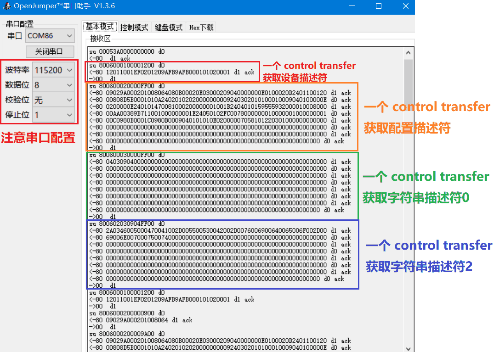|
| :----------------------------------------------------: |
|**Figure**: Debugging data printed on the UART when the USB UVC device is plugged into the computer.|

> When :warning:  using the debug interface, use the module parameters `DEBUG="TRUE"`. At `DEBUG="FALSE"` that time, `debug_en` 0 is maintained, and `debug_uart_tx` 1 is maintained (no debug information is output).

> :warning:  Because the transmission speed of UART is slow, when a large amount of debugging information is generated, some debugging information will be discarded by UART. For example, when UVC transmits video, the information printed by UART is incomplete because of the large amount of data transmitted. Therefore, if the debugging information needs to be viewed in the process of a large amount of data communication, the UART cannot be used, but other high-speed communication methods are used to send it `{debug_en, debug_data}` to the Host-PC for viewing.

 　

　

# References

* https://www.usbmadesimple.co.uk/ : USB Made Simple
* https://github.com/FengJungle/USB_Protocol_CH  USB Chinese Protocol Manual
* https://www.usb.org/document-library/usb-20-specification : USB 2.0 Specification
* https://www.usb.org/document-library/video-class-v11-document-set : USB Video Class (UVC) 1.1 Specification
* https://www.usb.org/document-library/audio-device-class-spec-basic-audio-devices-v10-and-adopters-agreement : USB Audio Class (UAC) 1.0 Specification
* https://www.usb.org/document-library/mass-storage-class-specification-overview-14 : USB Mass Storage Class (USB-MSC) 1.4 Specification
* https://www.usb.org/document-library/class-definitions-communication-devices-12 : USB Communication Device Class (USB-CDC) 1.2 Specification
* Other FPGA implementations:
  * https://github.com/avakar/usbcorev : a USB-device controller, only supported up to the transaction layer.
  * http://jorisvr.nl/article/usb-serial : One USB-CDC, VHDL implementation, requires additional UTMI PHY.
  * https://github.com/pbing/USB  A USB-HID implementation for Low Speed.
  * https://github.com/ultraembedded/cores : Contains some USB-host and USB-device implementations, requiring UTMI PHY or ULPI PHY.

　

　

　


　

<span id="cn">FPGA USB-device</span>
===========================

USB 1.1 device 控制器。可在 FPGA 上实现各种 USB 设备。比如 USB扬声器和麦克风、USB摄像头、U盘、USB键盘、USB串口 。

为了在 FPGA 上实现 USB 设备，通常的技术路线是使用 USB 芯片 (例如 Cypress CY7C68013)，导致电路和软件的开发成本较高。本库用 FPGA 实现一个通用的 USB 1.1 (Full Speed) device 控制器，可以像 STM32 单片机那样，用非常简单的电路来实现 USB 设备，而不依赖额外的 USB 芯片。基于此，我还在 FPGA 上实现了 USB音频、USB摄像头、U盘、USB键盘、USB-Serial (串口)，它们是 USB 所规定的标准设备，因此不需要安装驱动就能即插即用。

本库的特点：

- 纯 Verilog 实现，适用于 Xilinx 、Altera 等各种型号的 FPGA 。
- 所需的电路非常简单，除了FPGA外，**只需3个FPGA引脚，1个电阻，1个USB接口座**（见[电路连接](#circuit)）

如果你不熟悉 USB 协议栈，但想快速实现某种 USB 设备，可以使用我封装的一些 USB 功能：

- **USB音频** : 是一个复合设备，包括扬声器和麦克风 (双声道, 48ksps) ，提供接收扬声器音频数据、发送麦克风音频数据的流式接口。
- **USB摄像头** : 可向电脑传输视频（宽和高可自定义），提供发送视频数据的流式接口。
- **U盘**。
- **USB键盘**：提供"按键按下"的控制接口。
- **USB-Serial** : 实现串口设备，可在电脑上使用 minicom, putty, HyperTerminal, 串口助手等软件与 FPGA 进行数据传输。
- **USB-Serial-2ch** : 是一个复合设备，包括2个独立的 USB-Serial 。

如果你熟悉 USB 协议栈，可以使用本库来开发更多的 USB 设备 (详见[USB-device二次开发](#usbcore))。它提供：

- 自定义1个设备描述符(device descriptor)、1个配置描述符(configuration descriptor)、6个字符串描述符(string descriptor) 。
- 4 个 IN endpoint (0x81\~0x84) 、 4 个 OUT endpoint (0x01\~0x04) 。
- 可选的调试输出接口 (debug interface)，通过一个额外的UART打印调试信息到电脑，可以看到 USB 数据包的通信过程。

 　

## 效果展示

|                    | Windows 设备管理器中看到的设备 |            效果展示            |
| :----------------: | :----------------------------: | :----------------------------: |
|    **USB音频**     |     |   |
|   **USB摄像头**    |    |  |
|      **U盘**       |      |    |
|    **USB键盘**     |  |    每2秒按下一个英文字母键     |
|   **USB-Serial**   |    |  |
| **USB-Serial-2ch** |   |              同上              |

 　

## 兼容性

我测试了这些设备在不同操作系统上的兼容性，如下表。

|     兼容性测试     |     Windows 10     |          Linux Ubuntu 18.04          |    macOS 10.15     |
| :----------------: | :----------------: | :----------------------------------: | :----------------: |
|    **USB音频**     | :heavy_check_mark: | :heavy_check_mark: (不识别bug已解决) | :heavy_check_mark: |
|   **USB摄像头**    | :heavy_check_mark: |          :heavy_check_mark:          |        :x:         |
|      **U盘**       | :heavy_check_mark: |          :heavy_check_mark:          | :heavy_check_mark: |
|    **USB键盘**     | :heavy_check_mark: |          :heavy_check_mark:          | :heavy_check_mark: |
|   **USB-Serial**   | :heavy_check_mark: |          :heavy_check_mark:          | :heavy_check_mark: |
| **USB-Serial-2ch** | :heavy_check_mark: | :heavy_check_mark: (不识别bug已解决) | :heavy_check_mark: |

> :x: macOS 能识别我的 USB 摄像头设备，但无法读出视频，原因未知，留待后续解决。

 　

### 特别鸣谢

- 感谢 [github.com/xiaowuzxc](https://github.com/xiaowuzxc) 提交的 USB 扬声器的代码。本人后来将其拓展为现在的 USB音频 (扬声器+麦克风)
- 感谢 \*\*\*\*\*8125@qq.com 解决了 USB-Serial-2ch 中有一个通道不识别的问题。

 　

# <span id="circuit">Ⅰ 电路连接</span>

USB 具有 `VBUS`, `GND`, `USB_D-`, `USB_D+` 这4根线。以 USB Type B 连接座（俗称USB方口母座）为例，这4根线定义如下图。

|   |
| :-----------------------------------: |
| **图**：USB 连接座（方口母座）与线。 |

请进行如下图的电路连接。其中 `usb_dp_pull`, `usb_dp`, `usb_dn` 是 FPGA 的 3 个普通IO引脚（电平必须为 3.3V）。其中：

- FPGA 的 `usb_dn` 接 `USB_D-` 。:warning: 如果是飞线连接，要保证连接线长度在10cm以内。如果是PCB连接，要与 `usb_dp` 差分布线。
- FPGA 的 `usb_dp` 接 `USB_D+` 。:warning: 如果是飞线连接，要保证连接线长度在10cm以内；如果是PCB连接，要与 `usb_dn` 差分布线。
- FPGA 的 `usb_dp_pull` 要通过 1.5kΩ 的电阻接  `USB_D+` 
- FPGA 的 `GND`  接 USB 连接座的 `GND` 
- USB 连接座的 `VBUS` 是一个 5V, 500mA 的电源，可以不连，也可给 FPGA 供电。


```
  _________________
  |               |
  |   usb_dp_pull |-------|
  |               |       |
  |               |      |-| 1.5k resistor
  |               |      | |
  |               |      |_|        ____________                  __________
  |               |       |         |          |                  |
  |        usb_dp |-------^---------| USB_D+   |                  |
  |               |                 |          |    USB cable     |
  |        usb_dn |-----------------| USB_D-   |<================>| Host PC
  |               |                 |          |                  |
  |           GND |-----------------| GND      |                  |
  |               |                 |          |                  |
  -----------------                 ------------                  ----------
        FPGA                          USB 连接座                      电脑
                       图 : FPGA 连接 USB 的方法
```

 　

# Ⅱ 代码文件一览

[RTL](./RTL) 文件夹包含了所有代码，其中按层级分为三个文件夹：

|                  文件夹                  |      层级       | 说明                                                         |
| :--------------------------------------: | :-------------: | :----------------------------------------------------------- |
| [RTL/fpga_examples](./RTL/fpga_examples) |     应用层      | 在 USB class 的基础上实现具体的应用功能。为了方便测试，这里实现的应用功能非常简单，例如回环测试 USB-Serial、生成黑白条纹给 USB 摄像头。你可以开发复杂的应用，例如采集 CMOS 图象传感器的数据给 USB 摄像头。 |
|     [RTL/usb_class](./RTL/usb_class)     |    USB class    | 在 USB device core 的基础上实现了一些 USB class 。例如用 USB Communication Device Class (USB-CDC) 实现 USB-Serial；用 USB Video Class (UVC) 实现摄像头 …… |
|    [RTL/usbfs_core](./RTL/usbfs_core)    | USB device core | 一个通用的 USB device core，实现 USB 底层信号的处理，包括从 bit-level 到 transaction-level 。熟悉 USB 协议栈的开发者可以用它来开发更多的 USB 设备，详见 [USB device 二次开发](#usbcore) 。 |

 　

具体地，对每个代码文件说明如下：

|                  文件夹                  |          文件名          | 说明                                                         |
| :--------------------------------------: | :----------------------: | :----------------------------------------------------------- |
| [RTL/fpga_examples](./RTL/fpga_examples) |  fpga_top_usb_audio.v   | 把 usb_audio_top.v 的扬声器和麦克风回环连接，扬声器的放音会被麦克风录到 |
| [RTL/fpga_examples](./RTL/fpga_examples) |  fpga_top_usb_camera.v  | 生成黑白条纹给 usb_camera_top.v ，用照相机软件能看到这个黑白条纹 |
| [RTL/fpga_examples](./RTL/fpga_examples) |   fpga_top_usb_disk.v   | 用 usb_disk_top.v 实现了 24 KB 的 FAT16 文件系统的 U盘      |
| [RTL/fpga_examples](./RTL/fpga_examples) | fpga_top_usb_keyboard.v | 每2秒生成一个按键信号给 usb_keyboard_top.v                  |
| [RTL/fpga_examples](./RTL/fpga_examples) |  fpga_top_usb_serial.v  | 把 usb_serial_top.v 的发送和接收回环连接，电脑上发送的字符会被回显 |
| [RTL/fpga_examples](./RTL/fpga_examples) | fpga_top_usb_serial2.v  | 把 usb_serial2_top.v 的发送和接收回环连接，电脑上发送的字符会被回显 |
|     [RTL/usb_class](./RTL/usb_class)     |     usb_audio_top.v     | 复合设备，包括 2 个 USB Audio Class (UAC) ，实现 **USB扬声器+麦克风** |
|     [RTL/usb_class](./RTL/usb_class)     |    usb_camera_top.v     | USB Video Class (UVC) 实现 **USB摄像头**                     |
|     [RTL/usb_class](./RTL/usb_class)     |     usb_disk_top.v      | USB Mass Storage Class (USB-MSC) 实现 **U盘**                |
|     [RTL/usb_class](./RTL/usb_class)     |   usb_keyboard_top.v    | USB Human Interface Device Class (USB-HID) 实现 **USB键盘**  |
|     [RTL/usb_class](./RTL/usb_class)     |    usb_serial_top.v     | USB Communication Device Class (USB-CDC) 实现 **USB-Serial** |
|     [RTL/usb_class](./RTL/usb_class)     |    usb_serial2_top.v    | 复合设备，包含2个 USB-CDC ，实现 **双通道USB-Serial**        |
|    [RTL/usbfs_core](./RTL/usbfs_core)    |  **usbfs_core_top.v**   | USB device core 的顶层模块                                   |
|    [RTL/usbfs_core](./RTL/usbfs_core)    |   usbfs_transaction.v   | 实现 USB transaction-level，被 usbfs_core_top.v 调用        |
|    [RTL/usbfs_core](./RTL/usbfs_core)    |    usbfs_packet_rx.v    | 实现 USB packet-level RX，被 usbfs_core_top.v 调用          |
|    [RTL/usbfs_core](./RTL/usbfs_core)    |    usbfs_packet_tx.v    | 实现 USB packet-level TX，被 usbfs_core_top.v 调用          |
|    [RTL/usbfs_core](./RTL/usbfs_core)    |    usbfs_bitlevel.v     | 实现 USB bit-level，被 usbfs_core_top.v 调用                |
|    [RTL/usbfs_core](./RTL/usbfs_core)    |  usbfs_debug_monitor.v  | 收集调试信息（不干扰 USB 的功能），被 usbfs_core_top.v 调用 |
|    [RTL/usbfs_core](./RTL/usbfs_core)    |        uart_tx.v        | 将调试信息转为一个 UART 信号，被 usbfs_core_top.v 调用      |

下文逐一介绍本库提供的每一个 USB class 的使用方法。最后会介绍 [基于 USB device core 的二次开发](#usbcore) 。

 　

# Ⅲ USB 音频

本库的 USB 音频设备实现了扬声器+麦克风。代码文件调用关系如下。请将这些文件加入 FPGA 工程，编译并烧录到 FPGA 。

- RTL/fpga_examples/**fpga_top_usb_audio.v**
  - RTL/usb_class/**usb_audio_top.v**
    - RTL/usbfs_core/**usbfs_core_top.v**
      - RTL/usbfs_core/里的其它.sv文件(不逐个列出了)

> :warning: 本库的 USB core 需要 60MHz 的驱动时钟。**fpga_top_usb_audio.v** 里调用了 Altera 的 altpll 原语来把晶振的 50MHz 时钟转为 60MHz 时钟。如果你的 FPGA 不是 Altera Cyclone IV ，请删掉 altpll 部分的代码，然后用对应的原语或 IP 核来生成 60MHz 时钟。例如对于 Xilinx FPGA ，可以使用 Clock Wizard IP 。

### 测试

USB插入后，打开 Windows 设备管理器，应该能看到扬声器和麦克风设备：

 

由于 **fpga_top_usb_audio.v** 将扬声器和麦克风回环连接，因此扬声器的放音会被麦克风录到。为了测试，首先要选择该设备为音频输出设备：

 

然后随便放一个音乐。再用任意录音软件或录视频软件 (比如 obstudio) ，选择 FPGA-USB-audio 作为输入麦克风，录一段音或视频。最后你会发现录到的音频和你放的音乐一样。

### 应用开发

你可以基于这个简单的例子开发更复杂的音频应用，为此你需要关注 **usb_audio_top.v** 的模块接口，详见代码注释，这里不做赘述。

 　

# Ⅳ USB 摄像头

本库的 USB 摄像头设备的代码文件调用关系如下。请将这些文件加入 FPGA 工程，编译并烧录到 FPGA 。

- RTL/fpga_examples/**fpga_top_usb_camera.v**
  - RTL/usb_class/**usb_camera_top.v**
    - RTL/usbfs_core/**usbfs_core_top.v**
      - RTL/usbfs_core/里的其它.sv文件(不逐个列出了)

> :warning: 本库的 USB core 需要 60MHz 的驱动时钟。**fpga_top_usb_camera.v** 里调用了 Altera 的 altpll 原语来把晶振的 50MHz 时钟转为 60MHz 时钟。如果你的 FPGA 不是 Altera Cyclone IV ，请删掉 altpll 部分的代码，然后用对应的原语或 IP 核来生成 60MHz 时钟。例如对于 Xilinx FPGA ，可以使用 Clock Wizard IP 。

### 测试

USB插入后，打开 Windows 设备管理器，应该能看到摄像头设备：

 

打开 Windows 10 自带的照相机软件，应该能看到一个滚动的黑白条纹：

 

### 应用开发

你可以基于这个简单的例子开发更复杂的摄像头应用，为此你需要关注 **usb_camera_top.v** 的模块接口（详见代码注释）。

#### usb_camera_top.v 的参数

这里对关键的参数进行说明：

```verilog
// parameters of usb_camera_top.v
parameter        FRAME_TYPE = "YUY2",    // "MONO" or "YUY2"
parameter [13:0] FRAME_W    = 14'd320,   // video-frame width  in pixels, must be a even number
parameter [13:0] FRAME_H    = 14'd240,   // video-frame height in pixels, must be a even number
```

你可以用 `FRAME_W` 和 `FRAME_H` 设置视频帧的宽和高。`FRAME_TYPE` 可取 `"MONO"` 或 `"YUY2"` 。

##### FRAME_TYPE="MONO"

`FRAME_TYPE="MONO"` 是灰度模式，每个像素对应1字节的明度值。例如，对于一个 4x3 的视频帧，该模块会先后从外界读取以下12个字节：

```
Y00  Y01  Y02  Y03  Y10  Y11  Y12  Y13  Y20  Y21  Y22  Y23
```

其中 Y00 是第0行第0列的明度值；Y01 是第0行第1列的明度值；……

##### FRAME_TYPE="YUY2"

`FRAME_TYPE="YUY2"`  是一种彩色模式，又称为 YUYV ，每个像素具有独立的 1字节明度值(Y)，而相邻的两个像素共享1字节的蓝色度(U)和1字节的红色度(Y) 。例如，对于一个 4x2 的视频帧，该模块会先后从外界读取以下16个字节：

```
Y00  U00  Y01  V00  Y02  U02  Y03  V02  Y10  U10  Y11  V10  Y12  U12  Y13  V12
```

其中 (Y00, U00, V00) 是第0行第0列的像素；(Y01, U00, V00) 是第0行第1列的像素；(Y02, U02, V02) 是第0行第2列的像素；(Y03, U02, V02) 是第0行第3列的像素；……

#### usb_camera_top.v 的信号

 **usb_camera_top.v** 中用来从外界读取像素的信号是：

```verilog
// pixel fetch signals of usb_camera_top.v    start-of-frame |  frame data transmitting   | end-of-frame
output reg         vf_sof,                // 0000000001000000000000000000000000000000000000000000000000000    // vf_sof=1 indicate a start of video-frame
output reg         vf_req,                // 0000000000000000010001000100010001000100010001000000000000000    // when vf_req=1, a byte of pixel data on vf_byte need to be valid
input  wire [ 7:0] vf_byte,               //                                                                  // a byte of pixel data
```

 **usb_camera_top.v** 会通过以上信号不断读取视频帧，并发送给 Host-PC 。在每个视频帧的开始， `vf_sof` 会出现一周期的高电平。然后 `vf_req` 会断续地出现 **N** 次高电平，其中 **N** 是视频帧的字节数，对于 `FRAME_TYPE="MONO"` ，**N**=帧宽度×帧高度；对于 `FRAME_TYPE="YUY2"` ，**N**=2×帧宽度×帧高度 。每当 `vf_req=1` 时，外界应该提供一个字节（像素数据）到 `vf_byte` 信号上，最晚应该在 `vf_req=1` 后的第4个时钟周期让 `vf_byte` 有效，并且保持有效直到下一次 `vf_req=1` 。

### 帧率与性能

本模块以固定带宽发送视频到 Host-PC ，视频帧的尺寸越大，帧率越小。 USB Full Speed 的理论带宽是 12Mbps ，实际上本模块每1ms固定发送 800 字节的像素数据（400个像素），因此帧率的大致计算公式为：

帧率 = 400000 / (帧宽度×帧高度)    *(帧/秒)*

 　

# Ⅴ U盘

本库的 U盘设备的代码文件调用关系如下。请将这些文件加入 FPGA 工程，编译并烧录到 FPGA 。

- RTL/fpga_examples/**fpga_top_usb_disk.v**
  - RTL/usb_class/**usb_disk_top.v**
    - RTL/usbfs_core/**usbfs_core_top.v**
      - RTL/usbfs_core/里的其它.sv文件(不逐个列出了)

> :warning: 本库的 USB core 需要 60MHz 的驱动时钟。**fpga_top_usb_disk.v** 里调用了 Altera 的 altpll 原语来把晶振的 50MHz 时钟转为 60MHz 时钟。如果你的 FPGA 不是 Altera Cyclone IV ，请删掉 altpll 部分的代码，然后用对应的原语或 IP 核来生成 60MHz 时钟。例如对于 Xilinx FPGA ，可以使用 Clock Wizard IP 。

### 测试

USB插入后，打开 Windows 设备管理器，应该能看到一个硬盘：

 

Windows 文件资源管理器中应该能看到这个硬盘，里面有一个文件 "example.txt" 。你可以在这个硬盘里添加、修改、删除文件。由于它是用 FPGA 的片内存储器 (BRAM) 实现的，因此 FPGA 断电或重新烧录后，你的所有修改都会消失。这个硬盘的可用空间只有 3.5 KB ，基本上没啥用，仅供测试。

 

### 应用开发

你可以基于这个简单的例子开发更大或更复杂的 USB-disk ，为此你需要关注 **usb_disk_top.v** 的模块接口（详见代码注释）。

这里对其中关键的信号进行说明，包括：

```verilog
// signals of usb_disk_top.v
output reg  [40:0] mem_addr,      // byte address
output reg         mem_wen,       // 1:write   0:read
output reg  [ 7:0] mem_wdata,     // byte to write
input  wire [ 7:0] mem_rdata,     // byte to read
```

这些信号用于读写 **硬盘的存储空间** 。 `mem_addr` 是 41-bit 的字节地址，因此寻址空间为 2^41=2TB 。不过实际的硬盘存储空间肯定小于 2TB ，因此只有从 `mem_addr=0` 到 `mem_addr=硬盘容量` 的地址是有效的。在每个时钟周期：

- 如果 `mem_wen=1` ，说明 Host 想写一字节的数据给设备，写地址为 `mem_addr` ，写数据为 `mem_wdata` ；
- 如果 `mem_wen=0` ，设备需要读一个字节的数据，读地址为 `mem_addr`  ，读数据应该在下一周期送到  `mem_rdata` 上。

该接口非常容易接到 FPGA 的 BRAM 上，这样我们就用 BRAM 实现了硬盘的存储空间。

为了让 disk 能被识别为格式化好的硬盘，你可以给这个 BRAM 提供一个初始数据，里面包含一个文件系统。**fpga_top_usb_disk.v** 里的 BRAM 就实现了一个总大小为 24KB 的 FAT16 文件系统。

> :warning: 文件系统是用来组织文件的数据结构，和文件本身一样也存储在硬盘里。制作方法比较复杂，不在这里赘述。如果需要制作定制的 U盘设备，可以通过 issue 联系本人。

 　

# Ⅵ USB键盘

本库的 USB 键盘设备的代码文件调用关系如下。请将这些文件加入 FPGA 工程，编译并烧录到 FPGA 。

- RTL/fpga_examples/**fpga_top_usb_keyboard.v**
  - RTL/usb_class/**usb_keyboard_top.v**
    - RTL/usbfs_core/**usbfs_core_top.v**
      - RTL/usbfs_core/里的其它.sv文件(不逐个列出了)

> :warning: 本库的 USB core 需要 60MHz 的驱动时钟。**fpga_top_usb_keyboard.v** 里调用了 Altera 的 altpll 原语来把晶振的 50MHz 时钟转为 60MHz 时钟。如果你的 FPGA 不是 Altera Cyclone IV ，请删掉 altpll 部分的代码，然后用对应的原语或 IP 核来生成 60MHz 时钟。例如对于 Xilinx FPGA ，可以使用 Clock Wizard IP 。

### 测试

USB插入后，打开 Windows 设备管理器，应该能看到一个键盘设备：

 

该键盘会每2秒按下英文字母按键。打开一个记事本就能看到效果。

### 应用开发

你可以基于这个简单的例子开发更复杂的键盘应用，为此你需要关注 **usb_keyboard_top.v** 的模块接口（详见代码注释）。

这里的对其中用来发送按键信号的信号进行说明：

```verilog
// signals of usb_keyboard_top.v:
input  wire [15:0] key_value,     // Indicates which key to press, NOT ASCII code! see https://www.usb.org/sites/default/files/hut1_21_0.pdf section 10.
input  wire        key_request,   // when key_request=1 pulses, a key is pressed.
```

`key_request`平时需要保持为0，当你需要按下一个键时，需要让 `key_request=1` 一个周期，同时在 `key_value` 上输入该按键对应的代码。按键代码的定义详见 https://www.usb.org/sites/default/files/hut1_21_0.pdf 的 Section 10 。例如，按键 'a'-'z' 对应 `key_value=16'h0004~16'h001D`  ，按键 '1'-'0' 对应 `key_value=16'h001E~16'h0027`  。

 　

# Ⅶ USB-Serial

本库的 USB-Serial 设备的代码文件调用关系如下。请将这些文件加入 FPGA 工程，编译并烧录到 FPGA 。

- RTL/fpga_examples/**fpga_top_usb_serial.v**
  - RTL/usb_class/**usb_serial_top.v**
    - RTL/usbfs_core/**usbfs_core_top.v**
      - RTL/usbfs_core/里的其它.sv文件(不逐个列出了)

> :warning: 本库的 USB core 需要 60MHz 的驱动时钟。**fpga_top_usb_serial.v** 里调用了 Altera 的 altpll 原语来把晶振的 50MHz 时钟转为 60MHz 时钟。如果你的 FPGA 不是 Altera Cyclone IV ，请删掉 altpll 部分的代码，然后用对应的原语或 IP 核来生成 60MHz 时钟。例如对于 Xilinx FPGA ，可以使用 Clock Wizard IP 。

### 测试

USB插入后，打开 Windows 设备管理器，应该能看到一个 USB-serial 设备：

 

本例把 **usb_serial_top.v** 收到的数据按照 ASCII 码把小写字母转换为大写字母，然后回环连接到发送接口。你可以在 Host-PC 上用 minicom, putty, HyperTerminal, 串口助手的软件来发送数据给 Serial Port ，发送的数据会被回显（其中小写字母转化为大写字母）。以串口助手为例，如下图。

 

> :warning: 因为该 Serial-Port 并不是真正的 UART，所以又称为**虚拟串口**。设置虚拟串口的波特率、数据位、校验位、停止位将不会有任何效果。

### 应用开发

你可以基于这个简单的例子开发更复杂的 Serial-Port 通信应用，为此你需要关注 **usb_serial_top.v** 的模块接口（详见代码注释）。

这里对其中关键的信号进行说明，包括：

```verilog
// signals of usb_serial_top.v
// receive data (host-to-device)
output wire [ 7:0] recv_data,     // received data byte
output wire        recv_valid,    // when recv_valid=1 pulses, a data byte is received on recv_data
// send data (device-to-host)
input  wire [ 7:0] send_data,     // data byte to send
input  wire        send_valid,    // when device want to send a data byte, set send_valid=1. the data byte will be sent successfully when (send_valid=1 && send_ready=1).
output wire        send_ready,    // send_ready handshakes with send_valid. send_ready=1 indicates send-buffer is not full and will accept the byte on send_data. send_ready=0 indicates send-buffer is full and cannot accept a new byte. 
```

其中 host-to-device 的信号较为简单，每当收到数据字节时，`recv_valid` 出现一个周期的高电平，同时 `recv_data` 上出现该字节。

而 device-to-host 的信号方向相反，而且多出来了一个 `send_ready` 信号，`send_ready=0` 说明模块内部的发送缓冲区满了，暂时不能发送新的数据。 `send_ready`与 `send_valid` 构成握手信号，当用户需要发送一个字节时，应该让 `send_valid=1` ，同时让字节出现再 `send_data` 上。当 `send_valid=1 && send_ready=1` 时，该字节被成功送入发送缓存，用户就可以继而发送下一字节。该握手机制类似 AXI-stream 。

**usb_serial_top.v** 中有 1024 字节的发送缓存。如果需要发送的数据吞吐率不大，发送缓存永远不会满，也可也无视 `send_ready` 信号。然而，在数据吞吐率较大从而可能导致发送缓存满的情况下，如果无视 `send_ready=0`  的情况，可能导致部分数据丢失。

 　

# Ⅷ 双通道 USB-Serial

本库的双通道 USB-Serial 设备的代码文件调用关系如下。请将这些文件加入 FPGA 工程，编译并烧录到 FPGA 。

- RTL/fpga_examples/**fpga_top_usb_serial2.v**
  - RTL/usb_class/**usb_serial2_top.v**
    - RTL/usbfs_core/**usbfs_core_top.v**
      - RTL/usbfs_core/里的其它.sv文件(不逐个列出了)

> :warning: 本库的 USB core 需要 60MHz 的驱动时钟。**fpga_top_usb_serial2.v** 里调用了 Altera 的 altpll 原语来把晶振的 50MHz 时钟转为 60MHz 时钟。如果你的 FPGA 不是 Altera Cyclone IV ，请删掉 altpll 部分的代码，然后用对应的原语或 IP 核来生成 60MHz 时钟。例如对于 Xilinx FPGA ，可以使用 Clock Wizard IP 。

### 测试

USB插入后，打开 Windows 设备管理器，应该能看到2个 USB-serial 设备：

 

测试方法与单通道的 USB-Serial 相同，这里不做赘述。

### 应用开发

你可以基于这个简单的例子开发更复杂的 Serial-Port 通信应用，为此你需要关注 **usb_serial2_top.v** 的模块接口（详见代码注释），其用法与单通道的 USB-Serial 相同，只不过发送和接收接口都变成了双通道，这里不做赘述。

 　

# <span id="usbcore">Ⅸ 基于 USB device core 的二次开发</span>

你可以使用 **usbfs_core_top.v** 开发其它的 USB 设备，它提供：

- 自定义1个设备描述符(device descriptor)、1个配置描述符(configuration descriptor)、6个字符串描述符(string descriptor) 。
- 除了 control endpoint (0x00) 外，提供 4 个 IN endpoint (0x81\~0x84) 、 4 个 OUT endpoint (0x01\~0x04) 。
- 可选的调试输出接口 (debug interface)，通过一个额外的UART打印调试信息到电脑，可以看到 USB 数据包的通信过程。

下文对 **usbfs_core_top.v** 的参数和输入输出信号进行说明。

### usbfs_core_top.v 的参数

**usbfs_core_top.v** 的参数如下表。

| usbfs_core_top 的参数 | 类型                                    | 说明                                         |
| --------------------- | --------------------------------------- | -------------------------------------------- |
| `DESCRIPTOR_DEVICE`   | `logic[7:0][18]` (字节数组，长度为18)   | 设备描述符                                   |
| `DESCRIPTOR_STR1`     | `logic[7:0][64]` (字节数组，长度为64)   | 字符串描述符1                                |
| `DESCRIPTOR_STR2`     | `logic[7:0][64]` (字节数组，长度为64)   | 字符串描述符2                                |
| `DESCRIPTOR_STR3`     | `logic[7:0][64]` (字节数组，长度为64)   | 字符串描述符3                                |
| `DESCRIPTOR_STR4`     | `logic[7:0][64]` (字节数组，长度为64)   | 字符串描述符4                                |
| `DESCRIPTOR_STR5`     | `logic[7:0][64]` (字节数组，长度为64)   | 字符串描述符5                                |
| `DESCRIPTOR_STR6`     | `logic[7:0][64]` (字节数组，长度为64)   | 字符串描述符6                                |
| `DESCRIPTOR_CONFIG`   | `logic[7:0][512]` (字节数组，长度为512) | 配置描述符                                   |
| `EP00_MAXPKTSIZE`     | `logic[7:0]`                            | control endpoint 最大包大小                  |
| `EP81_MAXPKTSIZE`     | `logic[9:0]`                            | IN endpoint 0x81 最大包大小                  |
| `EP82_MAXPKTSIZE`     | `logic[9:0]`                            | IN endpoint 0x82 最大包大小                  |
| `EP83_MAXPKTSIZE`     | `logic[9:0]`                            | IN endpoint 0x83 最大包大小                  |
| `EP84_MAXPKTSIZE`     | `logic[9:0]`                            | IN endpoint 0x84 最大包大小                  |
| `EP81_ISOCHRONOUS`    | 0 或 1                                  | IN endpoint 0x81 是否是 isochronous 传输模式 |
| `EP82_ISOCHRONOUS`    | 0 或 1                                  | IN endpoint 0x82 是否是 isochronous 传输模式 |
| `EP83_ISOCHRONOUS`    | 0 或 1                                  | IN endpoint 0x83 是否是 isochronous 传输模式 |
| `EP84_ISOCHRONOUS`    | 0 或 1                                  | IN endpoint 0x84 是否是 isochronous 传输模式 |
| `EP01_ISOCHRONOUS`    | 0 或 1                                  | IN endpoint 0x01 是否是 isochronous 传输模式 |
| `EP02_ISOCHRONOUS`    | 0 或 1                                  | IN endpoint 0x02 是否是 isochronous 传输模式 |
| `EP03_ISOCHRONOUS`    | 0 或 1                                  | IN endpoint 0x03 是否是 isochronous 传输模式 |
| `EP04_ISOCHRONOUS`    | 0 或 1                                  | IN endpoint 0x04 是否是 isochronous 传输模式 |
| `DEBUG`               | "TRUE" 或 "FALSE"                       | 是否启用调试接口                             |

> :warning: 根据 USB 1.1 specification ，当一个 endpoint 是 isochronous 传输模式时，最大包大小可取 8\~1023 的任意值。当 endpoint 是 interrupt 或 bulk 传输模式时，最大包大小只能取 8, 16, 32, 或 64 。

### usbfs_core_top.v 的信号

#### 时钟与复位

需要给 `clk` 信号提供 60MHz 的时钟：

```verilog
// signals of usbfs_core_top.v
input  wire clk,           // 60MHz is required
```

复位信号 `rstn` 在正常工作时应该取高电平，如果需要停止工作，可以让 `rstn` 取低电平，此时如果 USB 插在 Host-PC 上，Host-PC 会检测到 USB 被拔出。

```verilog
// signals of usbfs_core_top.v
input  wire rstn,          // active-low reset, reset when rstn=0 (USB will unplug when reset)
```

#### USB 信号

以下3个信号需要引出到 FPGA 的引脚上，并按照 [电路连接方法](#circuit) 来连接到 USB 接口。

```verilog
// signals of usbfs_core_top.v
// USB signals
output reg  usb_dp_pull,   // connect to USB D+ by an 1.5k resistor
inout       usb_dp,        // USB D+
inout       usb_dn,        // USB D-
```

`usb_rstn` 信号指示了 USB 是否连接，高电平代表已连接；低电平代表未连接。未连接可能是有两种情况：要么USB线被从 Host 上拔出，要么 FPGA 侧主动进行复位（ `rstn=0` ）

```verilog
// signals of usbfs_core_top.v
output reg  usb_rstn,      // 1: connected , 0: disconnected (when USB cable unplug, or when system reset (rstn=0))
```

#### USB-transfer 和 USB-frame 检测信号

当以下两个信号 `sot` 和 `sof` 出现一周期的高电平时，分别指示了 USB-transfer 和 USB-frame 的开始。其中 USB-transfer 是指一个 USB transfer 的全过程，包括 control transfer, interrupt transfer, bulk transfer 和 isochronous transfer 。而 USB-frame 起始于 USB-host 每 1ms 会发送一次的 SOF token ，可以用来指导  isochronous transfer 。

```verilog
// signals of usbfs_core_top.v
output reg  sot,           // detect a start of USB-transfer
output reg  sof,           // detect a start of USB-frame
```

#### control transfer 响应信号

以下三个信号 `ep00_setup_cmd`, `ep00_resp_idx`, `ep00_resp` 提供了响应 control transfer 的接口。

```verilog
// signals of usbfs_core_top.v
// endpoint 0 (control endpoint) command response here
output wire [63:0] ep00_setup_cmd,
output wire [ 8:0] ep00_resp_idx,
input  wire [ 7:0] ep00_resp,
```

根据 USB specification ，control transfer 只在 control endpoint (0x00) 上进行，Host 会先发送 8 字节的 SETUP command ，根据 SETUP command ，device 可能响应数据给 Host 。根据 SETUP command 中的 `bmRequestType[6:5]` 字段，control transfer 可以分为三类：

- Standard control transfer (`bmRequestType[6:5]=0`)
- Class-specific control transfer (`bmRequestType[6:5]=1`)
- Vendor-specific control transfer (`bmRequestType[6:5]=2`)

其中 Standard control transfer 用来响应描述符等数据，在 **usbfs_core_top.v** 内部处理的，不需要开发者关心，开发者只需要用 parameter 指定好描述符即可。而 Class-specific control transfer 和 Vendor-specific control transfer 与具体设备的实现有关，开发者可以通过这三个信号响应它们。例如本库提供的 UVC 设备用它来响应 UVC Video Probe and Commit Controls ，而 HID 设备用它来响应 HID descriptor 。另外，有些简单的设备根本不需要 Class-specific control transfer 和 Vendor-specific control transfer ，则开发者可以无视这三个信号。

当一个 control transfer 进行时，`ep00_setup_cmd` 信号上先出现 8 字节的 SETUP command 。然后 `ep00_resp_idx` 信号从 0 开始递增，代表了当前需要响应第几个字节。开发者需要随时将响应数据的第  `ep00_resp_idx`  个字节打在 `ep00_resp` 信号上。

以 UVC 设备举例，以下代码检测 SETUP command 是否要求设备响应 UVC Video Probe and Commit Controls ，如果是，就响应 `UVC_PROBE_COMMIT` 数组中的第 `ep00_resp_idx`   字节打在  `ep00_resp` 信号上，否则就响应 `0x00` ：

```verilog
// 举例：在 UVC 设备中，当 host 请求 UVC Video Probe and Commit Controls 时，应该使用以下写法进行响应：
always @ (posedge clk)
    if(ep00_setup_cmd[7:0] == 8'hA1 && ep00_setup_cmd[47:16] == 32'h_0001_0100 )
        ep00_resp <= UVC_PROBE_COMMIT[ep00_resp_idx];
    else
        ep00_resp <= '0;
```

关于 control transfer 的命令和响应数据的内容，请参考具体的协议 specification 。

#### IN endpoint (0x81\~0x84) 数据输入信号

以下 4 组信号对应 4 个 IN endpoint ，用于发送 device-to-host 的 IN packet 。

例如，如果 FPGA 需要在 IN endpoint 0x81 上发送一个 IN packet ，需要：

- 首先，令 `ep81_valid=1`  并保持，同时在 `ep81_data` 上保持 packet 的第0个字节。
- `ep81_ready` 与 `ep81_valid` 构成握手信号。每当 `ep81_ready` 出现一个周期的高电平，说明一个字节被成功发送。
- 在 `ep81_ready=1` 的下一个周期，如果 IN packet 发送结束，需要令 `ep81_valid=0` 。如果 IN packet 还有字节每发完，保持  `ep81_valid=1`  ，并将  `ep81_data`  更新为新的待发送的字节。

```verilog
// signals of usbfs_core_top.v
// endpoint 0x81 data input (device-to-host)
input  wire [ 7:0] ep81_data,     // IN data byte
input  wire        ep81_valid,    // when device want to send a data byte, assert valid=1. the data byte will be sent successfully when valid=1 & ready=1.
output wire        ep81_ready,    // handshakes with valid. ready=1 indicates the data byte can be accept.
// endpoint 0x82 data input (device-to-host)
input  wire [ 7:0] ep82_data,     // IN data byte
input  wire        ep82_valid,    // when device want to send a data byte, assert valid=1. the data byte will be sent successfully when valid=1 & ready=1.
output wire        ep82_ready,    // handshakes with valid. ready=1 indicates the data byte can be accept.
// endpoint 0x83 data input (device-to-host)
input  wire [ 7:0] ep83_data,     // IN data byte
input  wire        ep83_valid,    // when device want to send a data byte, assert valid=1. the data byte will be sent successfully when valid=1 & ready=1.
output wire        ep83_ready,    // handshakes with valid. ready=1 indicates the data byte can be accept.
// endpoint 0x84 data input (device-to-host)
input  wire [ 7:0] ep84_data,     // IN data byte
input  wire        ep84_valid,    // when device want to send a data byte, assert valid=1. the data byte will be sent successfully when valid=1 & ready=1.
output wire        ep84_ready,    // handshakes with valid. ready=1 indicates the data byte can be accept.
```

#### OUT endpoint (0x01\~0x04) 数据输出信号

以下 4 组信号对应 4 个 OUT endpoint ，用于接收 host-to-device 的 OUT packet。

例如，当 `ep01_valid` 出现一个周期的高电平时，说明收到了 OUT packet 中的一个字节，该字节出现在 `ep01_data` 上。另外，packet 的边界可以用之前讲过的 `sot` 信号来检测。

```verilog
// signals of usbfs_core_top.v
// endpoint 0x84 data input (device-to-host)
input  wire [ 7:0] ep84_data,     // IN data byte
input  wire        ep84_valid,    // when device want to send a data byte, assert valid=1. the data byte will be sent successfully when valid=1 & ready=1.
output wire        ep84_ready,    // handshakes with valid. ready=1 indicates the data byte can be accept.
// endpoint 0x01 data output (host-to-device)
output wire [ 7:0] ep01_data,     // OUT data byte
output wire        ep01_valid,    // when out_valid=1 pulses, a data byte is received on out_data
// endpoint 0x02 data output (host-to-device)
output wire [ 7:0] ep02_data,     // OUT data byte
output wire        ep02_valid,    // when out_valid=1 pulses, a data byte is received on out_data
// endpoint 0x03 data output (host-to-device)
output wire [ 7:0] ep03_data,     // OUT data byte
output wire        ep03_valid,    // when out_valid=1 pulses, a data byte is received on out_data
// endpoint 0x04 data output (host-to-device)
output wire [ 7:0] ep04_data,     // OUT data byte
output wire        ep04_valid,    // when out_valid=1 pulses, a data byte is received on out_data
```

#### 调试输出接口

以下信号用来向外界打印调试信息。调试信息是一个 ASCII 码字节流，是人类可读的。当 `debug_en=1`  时， `debug_data` 上出现一个字节。

```verilog
// signals of usbfs_core_top.v
// debug output info, only for USB developers, can be ignored for normally use
output wire        debug_en,      // when debug_en=1 pulses, a byte of debug info appears on debug_data
output wire [ 7:0] debug_data,    // 
output wire        debug_uart_tx  // debug_uart_tx is the signal after converting {debug_en,debug_data} to UART (format: 115200,8,n,1). If you want to transmit debug info via UART, you can use this signal. If you want to transmit debug info via other custom protocols, please ignore this signal and use {debug_en,debug_data}.
```

为了方便使用，我还将 `{debug_en,debug_data}` 字节流转化位 UART 输出信号 `debug_uart_tx` ，可以将 `debug_uart_tx` 连接到电脑的 UART 上，用串口助手等软件来查看调试信息。注意 UART 的配置应该为 波特率=115200, 数据位=8，无校验位，停止位=1 。

下图展示了我的 USB UVC 设备插入电脑时 UART 上打印的调试数据。可以看到这是一个描述符枚举的过程。

|                      |
| :----------------------------------------------------: |
| **图**：USB UVC 设备插入电脑时 UART 上打印的调试数据。 |

> :warning: 使用调试接口时，要令模块参数 `DEBUG="TRUE"` 。当 `DEBUG="FALSE"` 时，`debug_en` 保持0 ，且 `debug_uart_tx` 保持1 （不会输出任何调试信息）。

> :warning: 因为 UART 的传输速度较慢，当大量的调试信息产生时，会有一部分调试信息被 UART 丢弃。例如当 UVC 进行视频传输时，因为传输的数据量很大，UART 打印的信息是不完整的。因此如果需要在大量数据通信的过程中查看调试信息，就不能用 UART ，而是用其它高速的通信方式将  `{debug_en, debug_data}` 发给 host-PC 来查看。

 　

　

# 参考资料

* https://www.usbmadesimple.co.uk/ : USB Made Simple
* https://github.com/FengJungle/USB_Protocol_CH : USB 中文协议手册
* https://www.usb.org/document-library/usb-20-specification : USB 2.0 Specification
* https://www.usb.org/document-library/video-class-v11-document-set : USB Video Class (UVC) 1.1 Specification
* https://www.usb.org/document-library/audio-device-class-spec-basic-audio-devices-v10-and-adopters-agreement : USB Audio Class (UAC) 1.0 Specification
* https://www.usb.org/document-library/mass-storage-class-specification-overview-14 : USB Mass Storage Class (USB-MSC) 1.4 Specification
* https://www.usb.org/document-library/class-definitions-communication-devices-12 : USB Communication Device Class (USB-CDC) 1.2 Specification
* 其它 FPGA 实现：
  * https://github.com/avakar/usbcorev : 一个 USB-device 控制器，仅支持到了 transaction 层。
  * http://jorisvr.nl/article/usb-serial : 一个 USB-CDC，VHDL实现，需要额外的 UTMI PHY。
  * https://github.com/pbing/USB : 一个 Low Speed 的 USB-HID 实现。
  * https://github.com/ultraembedded/cores : 包含一些 USB-host 和 USB-device 实现，需要 UTMI PHY 或 ULPI PHY。


